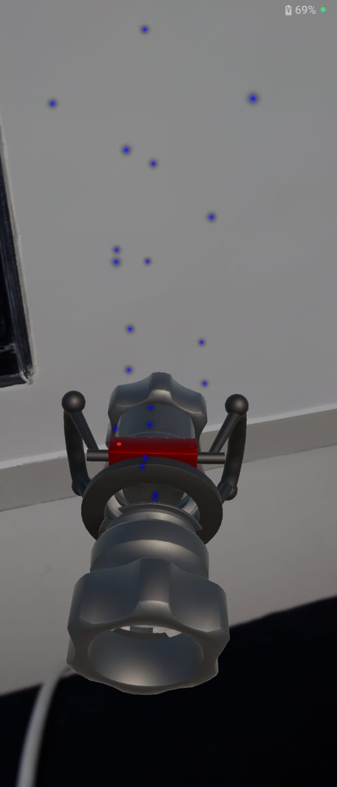
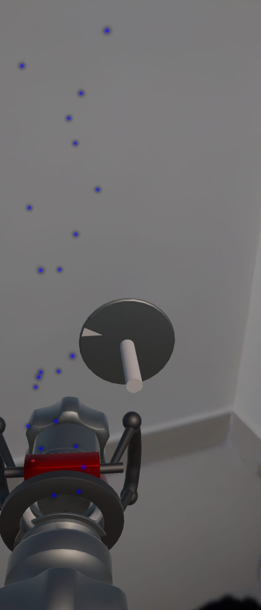
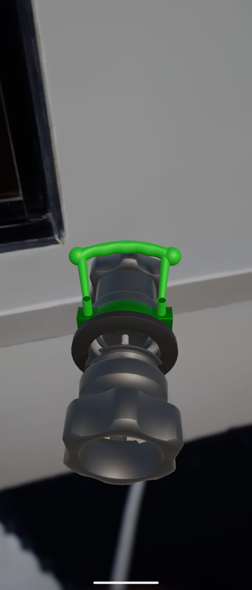

# Methanol Manifold AR Assessment – Dhruv Shah

## 🧩 Overview
This project simulates the connection process of a **QCDC Breakaway Coupling** system in **Augmented Reality**.  
The goal is to demonstrate an interactive drag, snap, and engage system where the user connects two coupling parts (male and female) and triggers a handle rotation and fluid flow once aligned correctly.

Built using **Unity 6000.0.47f1**, **AR Foundation**, and **ARCore XR Plugin**.

---

## 🚀 Core Features
- **AR-based 3D Interaction:** Drag and move the female coupling to align with the male coupling in AR space.  
- **Smart Snap System:** Automatic alignment and snapping once the correct position and angle are achieved.  
- **Handle Animation:** Handle rotates on successful engagement to simulate the locking mechanism.  
- **Flow Simulation:** Particle system activates to visualize fluid flow after locking.  
- **Event-based System:** Modular scripts that communicate through clean event triggers.  
- **Optimized for Mobile:** Smooth drag responsiveness and AR-compatible input system.

---

## 🧠 Script Descriptions

### 1️⃣ `DragAlign.cs`
This script allows the **female coupling** to be interactable in AR.  
- Handles touch/mouse input for dragging.  
- Detects proximity to the male coupling using distance checks.  
- Automatically aligns and snaps the female coupling to the male target when within a defined range.  
- Sends the `OnAligned` message to trigger the next stage (`SnapAndEngage`).  

**Attached to:** `FLAP_FEMALE`  
**Key Variables:**  
- `target`: the male coupling’s snap target.  
- `snapDistance`: distance threshold for auto-snap.  
- `moveSpeed`: how fast the object follows touch input.  

---

### 2️⃣ `SnapAndEngage.cs`
Central controller that manages the engagement process between the two couplings.  
- Receives the `OnAligned` message from `DragAlign`.  
- Triggers the **handle rotation** via `HandleRotateTween`.  
- Starts or stops the **flow particles** through `FlowController`.  
- Optionally communicates with a `ProgressTracker` for recording training progress.  

**Attached to:** `FLAP_MALE` (fixed coupling part)  
**Key Variables:**  
- `female`: reference to the female object.  
- `handleA`: main handle object to rotate.  
- `flowController`: controls particle flow.  
- `tracker`: optional, for logging states.

---

### 3️⃣ `HandleRotateTween.cs`
Controls the **handle rotation animation** to simulate locking or unlocking.  
- Uses DOTween (or Unity’s transform rotation) to animate smooth handle turns.  
- Sends callbacks `OnLocked()` and `OnUnlocked()` to control flow start/stop.  

**Attached to:** `HANDLE`  
**Key Variables:**  
- `lockedAngle`: target rotation angle for locking.  
- `rotateDuration`: time for the animation.  
- `onLocked` / `onUnlocked`: UnityEvents triggered on rotation completion.

---

### 4️⃣ `FlowController.cs`
Manages the **particle system** that simulates fluid flow between the couplings.  
- Provides methods `StartFlow()` and `StopFlow()` to control the effect.  
- Called automatically from `SnapAndEngage` or `HandleRotateTween` when engagement states change.  

**Attached to:** `FlowManager` or particle system object.  
**Key Variables:**  
- `flowParticles`: reference to the Unity Particle System.  
- `IsFlowing`: bool flag for current flow state.

---

### 5️⃣ `ProgressTracker.cs`
A lightweight helper used to record actions or progress events during interaction.  
- Logs events like “Aligned”, “Locked”, or “Flow Started”.  
- Can later be extended for analytics or UI feedback.  

**Attached to:** Optional (e.g., `FlowManager` or `UI Manager`)  
**Key Variables:**  
- `logText`: optional UI element for displaying logs.  
- `Record(string message)`: logs events for debugging or progress tracking.

---

### 6️⃣ `InputAbstraction.cs`
Utility class to standardize touch and mouse input between Editor and mobile builds.  
- Provides a unified function `PointerPosition()` to handle both environments.  
- Ensures smooth testing in Editor while maintaining correct input mapping on Android.  

**Used by:** `DragAlign.cs`  
**Key Variables:**  
- `PointerPosition()`: returns current pointer/touch screen position.

---

## 🧱 Scene Setup Overview

Initially after the App opens the Manifold will be decoupled and Steam/Water will be flowing with the handle **Unlocked**.

You can move the Female Coupling part by **Touching and Dragging** the part to the Male Coupling Part.

After you Sucessfully Link the Female part to the Male part it **Locks** into place and the **Handle Rotates** and Steam/Water Stops Leaking.

---

## 🔧 Tools & Frameworks Used
- **Unity 6000.0.47f1**  
- **AR Foundation 6.x**  
- **ARCore XR Plugin**  
- **DOTween (for animation)**  
- **C# (Unity scripting)**  

---

## 📱 Interaction Flow

1. Launch the AR app and scan your environment.  
2. Tap and drag the **female coupling** toward the **male coupling**.  
3. When aligned, it **snaps** into place.  
4. The **handle rotates automatically** to simulate locking.  
5. The **flow particles start** to show fluid transfer.  

---

## 🧩 Known Issues / Notes
- The app requires **camera permission** to be accepted for AR to initialize properly.  
- Works best on Android devices that support **ARCore**.  
- Build tested on Unity 6000.0.47f1 with Android SDK 34.  

## Future Additions 

- Ui Element to tell users to drag the correct part.
- Ability to pinch and zoom as well as rotate the model.
---

## 🧾 Deliverables
- **APK Build:** https://drive.google.com/file/d/1ru72YG7EaE2qwarJvxAvn_BK8TiJ_E5I/view?usp=sharing
- **Demo Video:** https://drive.google.com/file/d/1nBzmhtSKibfBZW71OpvkQhgzRcGaJ2o5/view?usp=sharing

---

## 👤 Author
**Dhruv Shah**  

---

### ⭐ Notes
This project was completed as part of the **Game Coder Assessment** for Manifold Group.  
It showcases my ability to handle AR interactions, physics-based snapping, animation logic, and modular event-driven systems in Unity.
